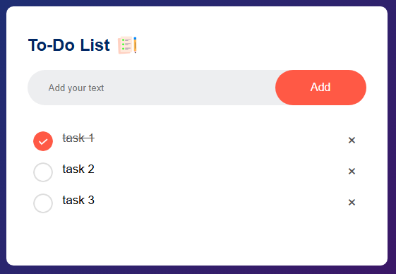

# To-Do List App

A simple and responsive To-Do List web application built using HTML, CSS, and JavaScript.  
It allows users to add, complete, and delete tasks — a great starting point for learning DOM manipulation and UI structuring.

---

## About This Project

This is my **first front-end project**, created while following a [YouTube tutorial by Easy Tutorials](https://www.youtube.com/watch?v=G0jO8kUrg-I&list=PLjwm_8O3suyOgDS_Z8AWbbq3zpCmR-WE9&index=2).  
The goal was to build a functioning To-Do List from scratch and practice the basics of web development with HTML, CSS, and JavaScript.

---

## Features

- Add new tasks
- Delete tasks
- Mark tasks as completed
- Clean and simple UI

---

## Technologies Used

- HTML5
- CSS3
- JavaScript (Vanilla)

---

## Folder Structure

To-Do-List/
├── index.html
├── style.css
├── script.js
└── README.md

yaml
Copy
Edit

---

## Screenshots



---

## Getting Started

To run this project locally:

1. Clone the repository:
   ```bash
   git clone https://github.com/nicoleromeroo/To-Do-List.git

2. Navigate to the project folder:

bash
cd To-Do-List

3. Open index.html in your browser.

Future Improvements
 - Add task filtering (e.g., All / Active / Completed)

 - Add drag-and-drop reordering

 - Add due dates and reminders

 - Store tasks in local storage

 - Add dark mode


## Author
Nicole Romero
GitHub: @nicoleromeroo